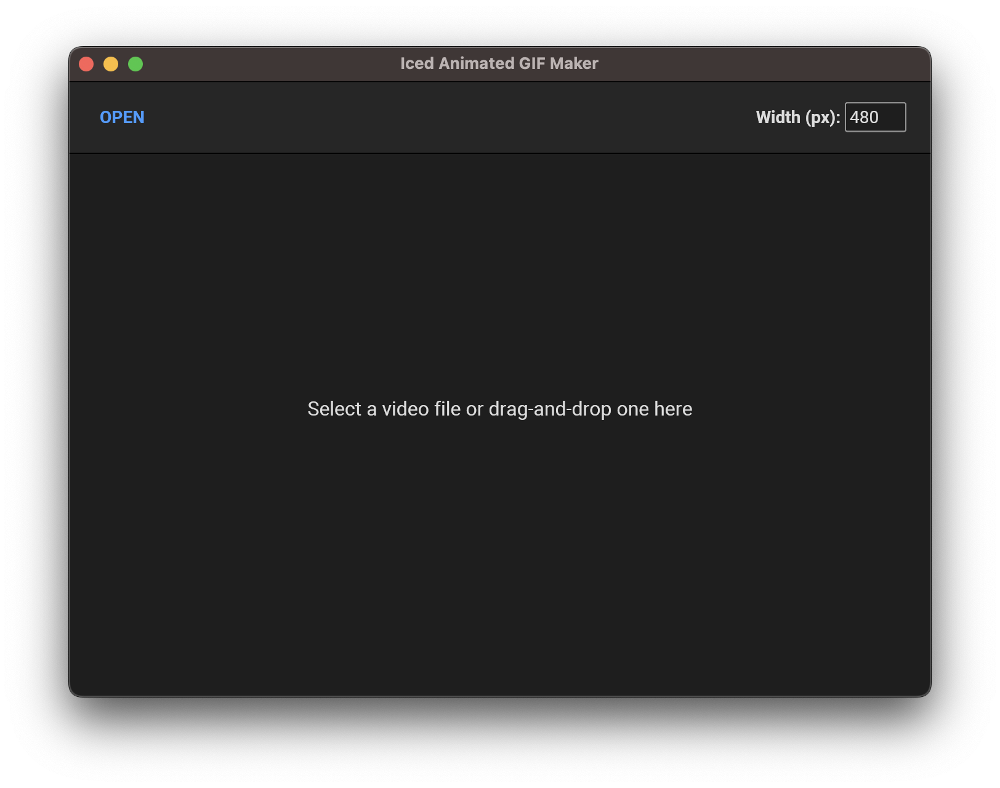
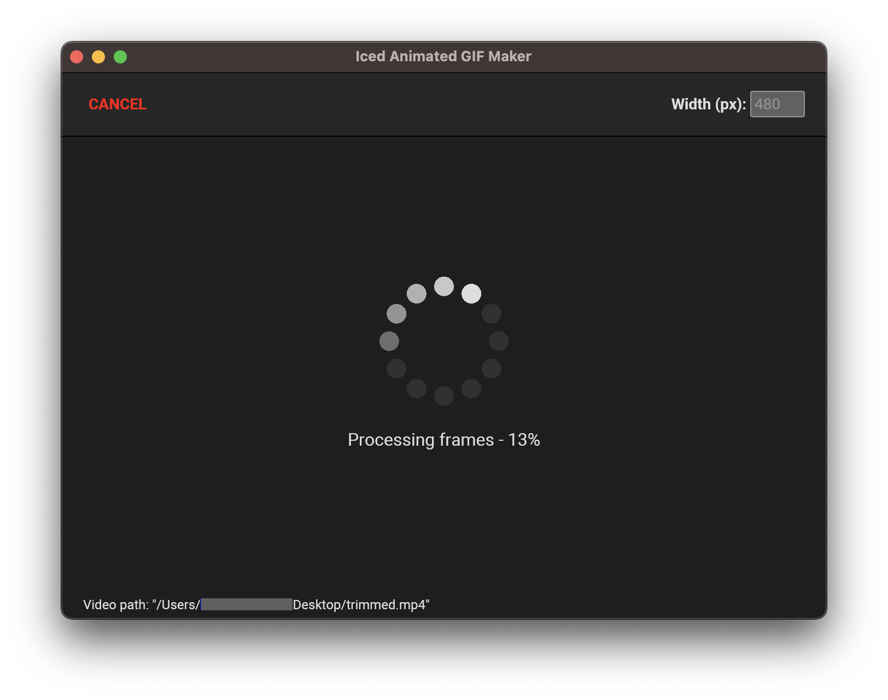
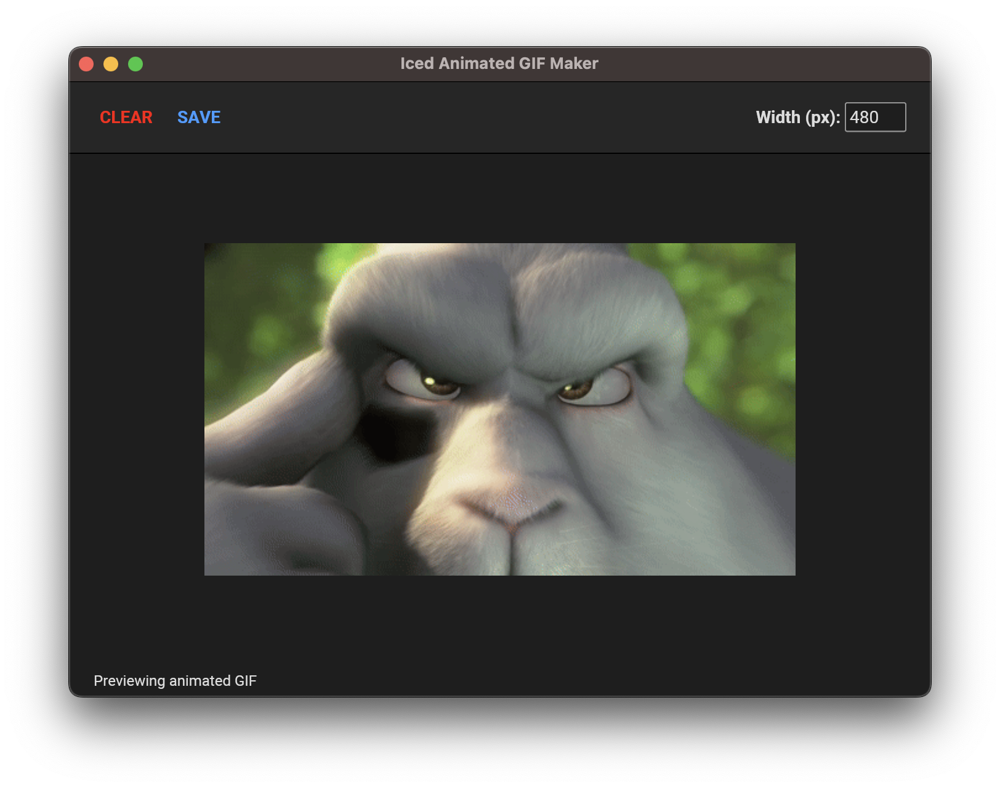

# Iced Animated GIF Maker

This is a simple [FFmpeg](https://www.ffmpeg.org/)-based animated GIF generator application built using [Iced](https://docs.rs/iced/0.10.0/iced/index.html).

**NOTE**: Please take the time to read the [potential issue](#potential-issue) section before running this application.







## How to use

* To start converting a video into an animated GIF, simply drag-and-drop a video file on the application window or click on the `open button` to trigger your system's native file picker dialog.
* The GIF's width defaults to 480 pixels, but you can use the `width input` to change that value.
  * NOTE: The GIF's frame rate is fixed at 10 FPS.
* When the job completes, the animated GIF automatically gets previewed by the application.
* To save the generated GIF, simply click on the `save button` to trigger your system's native file picker (i.e. saver) dialog.
* The `cancel button`, when visible, may be used to cancel an ongoing job and clear the UI.
* The `clear button`, when visible, may be used to clear the UI for a completed job.

## How it works

Video to animated GIF conversion is achieved using `FFmpeg`. The application uses the [rust-ffmpeg-gif-maker](https://github.com/BB-301/rust-ffmpeg-gif-maker/releases/tag/0.1.1) wrapper library to communicate with `FFmpeg` by making a system call to it and capturing and interpreting its `stdout` and `stderr`. In turn, the `Iced` application communicates with the library using an asynchronous worker, similar to the one described in the official documentation for [iced::subscription::channel](https://docs.rs/iced/0.10.0/iced/subscription/fn.channel.html).

## Target audience

This project is mainly targeted at Rust programmers who are in the process of learning `Iced`. It makes use of concepts such as:

* using an asynchronous worker based on [iced::subscription::channel](https://docs.rs/iced/0.10.0/iced/subscription/fn.channel.html) to allow communicating between an `Iced` application and something else (in this case a child process),
* implementing `Iced`'s [subscription method](https://docs.rs/iced/0.10.0/iced/application/trait.Application.html#method.subscription),
* using the [rfd](https://github.com/PolyMeilex/rfd) library to trigger native file picker dialogs,
* importing and configuring custom fonts,
* creating an using a [component](https://docs.rs/iced/0.10.0/iced/widget/trait.Component.html),
* performing custom styling,
* and other stuff.

## How to build

### Potential issue

This project uses the [rfd](https://github.com/PolyMeilex/rfd) library to display native file picker dialogs. I noticed, on my development system (i.e. `macOS`), that running the application with `cargo run` or by simply executing the binary in a terminal (e.g. `./target/release/iced_gif_maker`) will cause `rfd` to crash the application when trying to trigger a dialog. On the other hand, no problem arises, for instance, when starting the application using the following syntaxes: `/bin/bash -c "cargo run --release"` or `env cargo run --release`. Launching the application from a shell script will also solve the problem.

At this point, I'm not sure whether this is a permission issue, an environment issue, or something else, but, in the meantime, I recommend trying these workarounds if you face a similar issue when triggering dialogs. If none of these workarounds work, please let me know by [opening an issue](https://github.com/BB-301/rust-iced-gif-maker/issues) and we'll try to figure this out together.

### Requirements

* The `ffmpeg` binary must be available on your system's path.
  * Note that it is possible to use the `ICED_GIF_MAKER_FFMPEG_PATH` environment variable to specify the absolute location of the binary on the system if the binary is not on the path. See [Build and running - More options](#more-options) for an example.
  * If you need to download `FFmpeg`, please visit the official [FFmpeg download page](https://ffmpeg.org/download.html).
  * NOTE: At the moment, the [rust-ffmpeg-gif-maker](https://github.com/BB-301/rust-ffmpeg-gif-maker/releases/tag/0.1.1) library has successfully been tested with `ffmpeg version 5.0-tessus` and `ffmpeg version 6.0-tessus` on `macOS`. So please feel free to let me know by [opening an issue](https://github.com/BB-301/rust-iced-gif-maker/issues) if you encounter any problems when trying to build and run on your system.

### Building and running

1. Clone the Git repository from GifHub:
```
git clone https://github.com/BB-301/rust-iced-gif-maker.git
```
2. Move into the cloned repository:
```
cd rust-iced-gif-maker
```
3. Run in release mode
```
cargo run --release
```

#### More options

* Use the `ICED_GIF_MAKER_FFMPEG_PATH` environment variable to specify the path of the `ffmpeg` binary on your system. E.g.:
```
ICED_GIF_MAKER_FFMPEG_PATH=/absolute/path/to/ffmpeg cargo run --release
```
* Enable logging. E.g.:
```
# If `RUST_LOG` is not provided, the application will set it
# to `iced_gif_maker=debug,ffmpeg_gif_maker=info`.
cargo run --release --features logging

# Or, to specify `RUST_LOG` yourself, you can do something like this:
RUST_LOG="iced_gif_maker=debug" cargo run --release --features logging
```

## Still to do...

* I have yet to test this application on a Windows system.
* I need to fix the bug described in [How to build - Potential issue](#potential-issue), about [rfd](https://github.com/PolyMeilex/rfd) making the application crash on `macOS` (and maybe elsewhere) when some environment variable(s) is(are) missing.
* Ideally, the application would warn the user when (if) a save operation fails. But currently the application only prints whether the save operation was successful or not to `stdout`.
* This project currently relies on a [forked version](https://github.com/BB-301/iced_gif/tree/tmp) of the [iced_gif](https://github.com/tarkah/iced_gif) widget repository. In this application, the `iced_gif::gif::Frames::from_bytes` (from the `tokio` feature flag) is used to decode the animated GIF into frames that are required by the widget. But when starting a decoding job, that job cannot be cancelled. This is generally not a problem for small to mid sized GIFs, but it could be wasteful for bigger ones. A simple solution around this problem would be to modify `iced_gif::gif::Frames::from_bytes` with an optional argument for the receiver's part of a channel that would allow cancelling a job, and then use that channel's sender part to signal cancellation from the application, when required.

## Contact

If you have any questions, if you find bugs, or if you have suggestions for this project, please feel free to contact me by opening an issue on the [repository](https://github.com/BB-301/rust-iced-gif-maker/issues).

## License

This project is released under the [MIT License](./LICENSE).